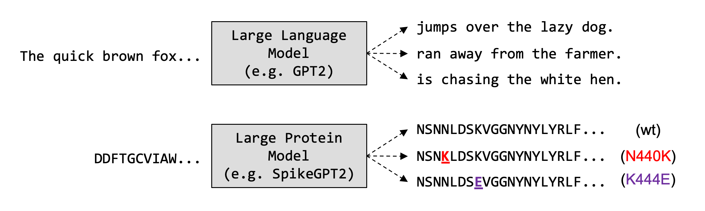

# Predict SARS-Cov2 Variants with SpikeGPT2

This repository contains an implementation of using pretrained language models
to predict the evolution of the SARS-CoV2 spike protein as variants develop.
The SpikeGPT2 model is a fine-tuned version of the ProtGPT2 model recently described by
*Ferruz et al.* (PMID: [35896542](https://pubmed.ncbi.nlm.nih.gov/35896542/)).

SpikeGPT2 is fine-tuned on SARS-CoV-2 spike protein sequences, and can be
used for synthesis of any portion of the S protein.  It has been tested
in prediction of variants in the receptor-binding motif subdomain of the
SARS-CoV-2 S protein.

Note that this repository contains code that can be very easily adapted to
the prediction of other protein sequences of interest.  The `src/run_clm.py` file
is a modified version of the same script provided by the HuggingFace transformers
team that is designed to be run only with the ProtGPT2 model as a base.  It
implements freezing of all but the final GPT2 transformer layer.

## Data
SARS-CoV2 spike protein sequences were obtained from the NIH Sars-CoV2 Data Hub
accessible at 

    https://www.ncbi.nlm.nih.gov/labs/virus/vssi/

Note that the reference sequence for the surface glycoprotein can be found at:

    https://www.ncbi.nlm.nih.gov/protein/1791269090

## Evaluation
Distance between predicted sequences and true variant spike proteins were
computed by using the string edit distance between the amino acid sequences,
as compared to chance. 

As the loaded ProtGPT2 model was pretrained on the
UniRef50 (version 2021_04) dataset, it cannot have contained sequencing
data that was generated after that date.  Evaluations will be conducted using
SARS-CoV2 sequences generated after May 2021.

### MutaBind2
The MutaBind2 tool was used to evaluate the effect of single-residue amino
acid substitutions on viral fitness. (https://lilab.jysw.suda.edu.cn/research/mutabind2/)

Note the following relevant PDB codes:

    7DF4 (Spike-ACE2 complex Cryo-EM solved structure)

Binding of RBD to therapeutic antibodies:

    8D8Q (Tixagevimab + cilgavimab (Evushield) used for COVID PrEP)

Some manual entry of chain identities were required to define
which particular amino acid chains should be included in the binding
affinity simulations.

## Orchestration
Code to run these experiments is organized using a simple `Makefile`.
All software is designed to be run within a `conda` environment, requirements
file to be `pip` installed once environment is initialized.

    conda create -n covid_pred python=3.9

Then:

    conda activate covid_pred
    pip install -r requirements.txt

If you are running on the yale Farnam HPC, you will need to additionally run:

    conda install pytorch==1.11.0 torchvision==0.12.0 torchaudio==0.11.0 cudatoolkit=11.3 -c pytorch

And if you would like to finetune the `ProtGPT2` model, you will need to install
huggingface Tranformers from source with:

    pip install git+https://github.com/huggingface/transformers

## Running the Code
Some short comments below on running several key steps of the pipeline.
Please refer to the `Makefile` for more details.

### Base Commands
The following commands can be easily adapted for use with other pathogen
polypeptide sequences of interest, as described in the SpikeGPT2 manuscript.

    make clean

Cleans FASTA files and prepares multiline sequences for fine-tuning by
representing data as multiple lines of text with the required
`'<|endoftext|>'` tokens added. Random subsampling is implemented here
as well.

    make finetune

Fine-tunes the model given the provided input files after cleaning using
`make clean`.

### SARS-CoV-2 S RBM Specific Commands
The following commands are designed specifically for the task of predicting
SARS-CoV-2 S RBM fragment single amino-acid substitutions, and will require some
adaptation to be used with other pathogen sequences, or to predict other
mutational types.

    make run

Generates synthetic fragments by running the fine-tuned model.

    make call_substitutions

Call substitutions using biopython utilities.

    make visualize

Generate visualizations used in the SpikeGPT2 manuscript.  Note that this
command uses `R` instead of `python`.  

A PyMOL script is also provided at `./src/pymol_opensource_viz.pml` to generate
the substitutions and views provided in the SpikeGPT2 manuscript, but the script
must be run interatively as it requires creation of appropriate directories
prior to running, and uses the PyMOL mutagenesis wizard, which requires
selection of residues to mutate and visual assessment of substituted rotamers.
